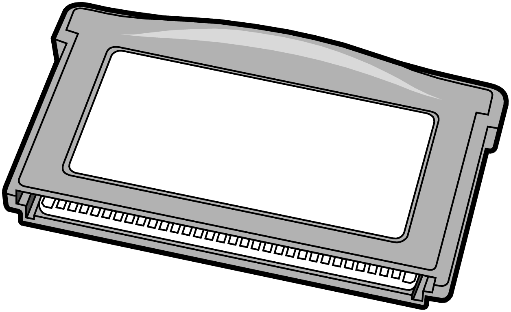

# GBA Resume

<p align="center">
  
</p>

An interactive resume built as a Game Boy Advance homebrew application using the Butano engine. Navigate through different sections to explore experience, projects, skills, and education in a retro gaming format.

## 📋 Prerequisites

- **Python 3**
- **devkitARM** - GBA development toolchain from [devkitPro](https://devkitpro.org/)
- **ImageMagick** or **FFmpeg** - For image/video conversion
- **Git** - For cloning with submodules

## 🛠️ Building

1. **Clone the repository with submodules:**
   ```bash
   git clone --recursive https://github.com/yourusername/gba-resume.git
   cd gba-resume
   ```

2. **Install devkitARM:**
   Follow the installation guide at [devkitPro Getting Started](https://devkitpro.org/wiki/Getting_Started)

3. **Build the ROM:**
   ```bash
   make
   ```

   The compiled ROM will be at `web/resume.gba`

## 🎯 Running

### On Real Hardware
Flash `web/resume.gba` to a GBA flashcart

### On Emulator
Open `web/resume.gba` in your favorite GBA emulator (mGBA, VBA-M, etc.)

### In Browser
1. Copy a GBA BIOS file to `web/bios.bin`
2. Open `web/index.html` in a modern web browser
3. The game will auto-start with touch/mouse controls


## 🙏 Acknowledgments

- [Butano](https://github.com/GValiente/butano) - Modern C++ GBA engine
- [GBAjs2](https://github.com/andychase/gbajs2) - JavaScript GBA emulator
- [devkitPro](https://devkitpro.org/) - GBA development toolchain

## 📄 License

This project is licensed under the MIT License

### Third-Party Licenses
- **Butano Engine**: zlib License
- **GBAjs2 Emulator**: 2-clause BSD License